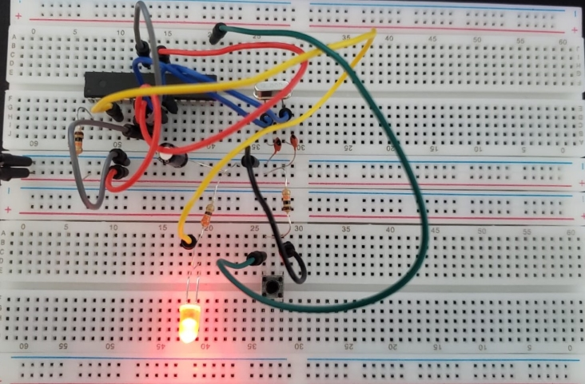

# LED Blinking Project

This is a simple project to control the blinking of an LED on an AVR microcontroller using the C programming language. The LED blinking pattern can be altered by pressing a button.

## Required Hardware

- AVR Microcontroller (e.g., ATmega328p)
- LED
- Resistors
- Button
- Breadboard and wires

