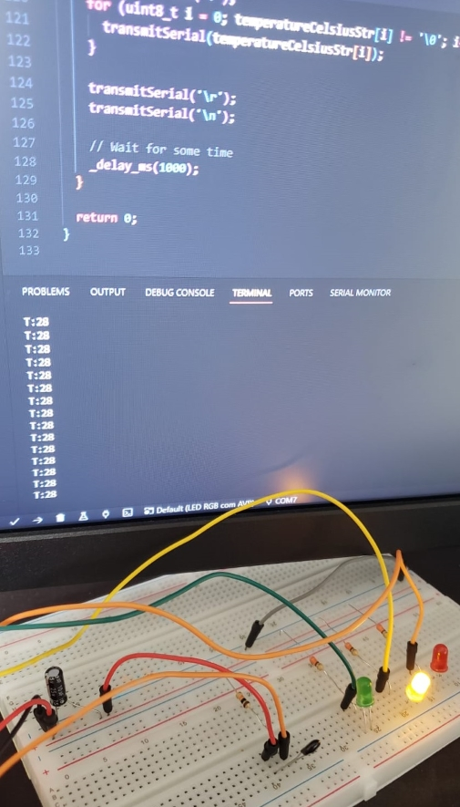

# Temperature Monitoring System with AVR

This project involves a temperature monitoring system using an AVR microcontroller. It reads the temperature from a thermistor, processes the data, and controls LEDs based on the temperature range.

## Overview

This project is designed to showcase a simple temperature monitoring system using an AVR microcontroller (e.g., ATmega328P). It employs a thermistor to measure the temperature, the ADC to convert the analog signal to a digital value, and LEDs to display the temperature range.

The code is written in C and uses AVR-GCC for compilation. The project includes functionalities for ADC setup, temperature calculation, and LED control. Additionally, it demonstrates serial communication for debugging purposes.

